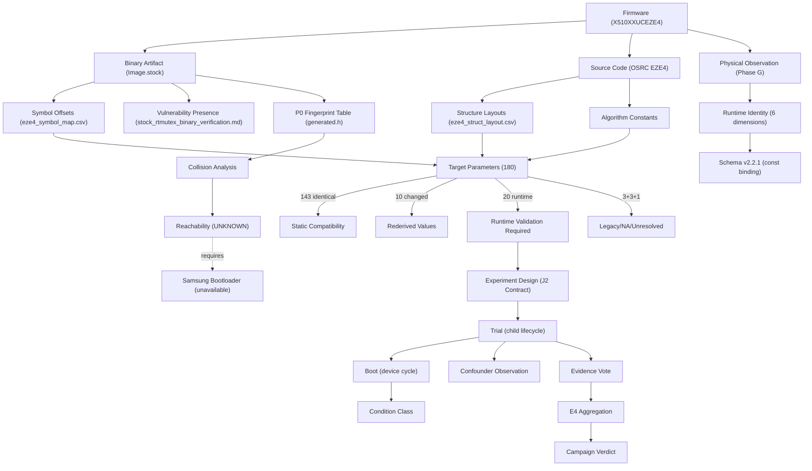

# Project Ontology — RMG-EZE4

## Entity Relationships

## Category Error Prevention Rules

1. **Firmware artifact** cannot prove **runtime behavior**
2. **Source semantics** cannot prove **stock binary behavior** (must verify via disassembly)
3. **Rebuild address** cannot substitute for **stock address**
4. **struct sizeof** cannot substitute for **allocation bucket size**
5. **P0 label** cannot substitute for **physical KASLR offset** or **virtual displacement**
6. **Environment observation** cannot substitute for **consumer validation**
7. **Parameter absence** cannot substitute for **parameter incompatibility**
8. **Single occurrence** cannot satisfy **statistical evidence threshold**
9. **Schema compliance** cannot prove **runtime availability** of required telemetry
10. **Test PASS** cannot prove **correct validation** when test and validator share constants
