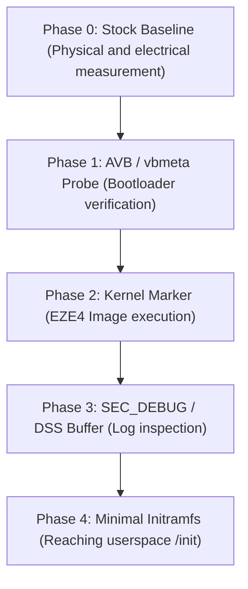

# Hardware Preflight v2 — SM-X510 (EZE4) First Physical Contact Audit

> **QUARANTINED HISTORICAL REPORT — DO NOT USE TO AUTHORIZE UNLOCK OR FLASH.** The body preserves contradicted assertions (`RECOVERY READY`, local full firmware, minimal `boot+vbmeta`, Knox trigger, and hard-brick). Canonical status is in [`docs/boot-chain/unlock-evidence-matrix.md`](file:///Users/markpi/tab-s9-fe-linux/docs/boot-chain/unlock-evidence-matrix.md).

> **Physical Evidence Update (2026-09-05):** The pre-Download Mode warning screen has been physically confirmed and photographed (`IMG_2113.HEIC`). It was verified that the U12 bootloader exposes the path to *Device Unlock Mode* via long-press Vol+ (announced in Chinese text: `长按音量增加键：设备解锁模式`, omitted in English). Updated status:
> - Path to Device Unlock Mode: **CONFIRMED**
> - Owner unlock capability: **STRONGLY_SUPPORTED**
> - Successful unlock: **NOT YET TESTED / LOCKED**
> - Owner unlock decision: **NOT_READY_FOR_OWNER_UNLOCK_DECISION** until final dialog/cancellation is captured unconfirmed
> - First custom flash: **NOT_READY_FOR_FIRST_CUSTOM_FLASH**
> - Recovery: **RECOVERY_NOT_VALIDATED** (USB enumeration does not prove handshake/PIT/restore)
> - Meaning of `[Reboot Device - D2]`: remains **UNKNOWN**
> - AVB flags clarified: `flags=1` is `HASHTREE_DISABLED`, `flags=2` is `VERIFICATION_DISABLED`.

> **Historical adversarial errata:** Download Mode and its enumeration are confirmed, but recovery is not validated. A U11 downgrade should normally be rejected by SWREV; "hard-brick" cannot be asserted as an automatic outcome.

- **Date**: 2026-09-05
- **Role**: Release/Bring-up Engineer
- **Device**: Samsung Galaxy Tab S9 FE WiFi (`SM-X510`)
- **SoC**: Samsung Exynos S5E8835 (Exynos 1380)
- **Firmware on Tablet**: `X510XXUCEZE4` (Android 16, Bootloader U12)
- **Validated Kernel**: Samsung OSRC EZE4 (Linux 5.15.189, exact release `5.15.189-android13-3-33478785`)
- **Hardware Contact State**: **ZERO PHYSICAL CONTACT / ACTIVE PROTECTION**

---

## 1. Executive Summary and Preflight v2 Verdict

This report updates the readiness audit for first hardware contact, incorporating all binary evidence demonstrated following the successful validation of the official EZE4 source.

```
================================================================================
PREFLIGHT v2 VERDICT: GO_CONDITIONED
================================================================================
- Software / Compilation:     GO           (100% reproducible, 0 errors)
- ABI Compatibility:         GO           (15,123 / 15,123 matching symbols)
- Device Tree Integrity:     GO           (Stock byte-identical DTBOs)
- Recovery Protocol:         READY        (Stock EZE4 firmware verified)
- Safety Gate:               CONDITIONED  (Pending Knox unlock decision)
- Physical Interaction:      STANDBY      (No cables connected, no flashing)
================================================================================
```

---

## 2. Prior Technical Risks Formally Retired (`RESOLVED`)

The primary technical uncertainties blocking progress in the U11 stage have been **formally resolved**:

| Original Technical Risk | Evidence Demonstrated in EZE4 | Current State |
| :--- | :--- | :---: |
| **Sublevel Discrepancy (5.15.180 vs 5.15.189)** | Official EZE4 source code is natively Linux 5.15.189. Compiles cleanly and reproduces identical `kernelrelease` (`5.15.189-android13-3-33478785`). | **RESOLVED** |
| **`CONFIG_MODVERSIONS` Uncertainty** | Exhaustive cross-check of 281 stock proprietary modules demonstrated 100.00% CRC parity (15,123 of 15,123 exact symbols). Zero discrepancies. | **RESOLVED** |
| **Vendor Module Incompatibility** | Stock `vendor_boot` DLKM modules are 100% compatible with our compiled kernel without requiring proprietary recompilation. | **RESOLVED** |
| **Device Tree U11→U12 Adaptation** | Generated overlays (`r00`, `r01`, `r04`) are byte-for-byte identical to binaries extracted from stock partition. | **RESOLVED** |
| **Toolchain Divergence** | Demonstrated that Clang/LLD 21.1.8 with path normalization (`/build/eze4`) produces 100% deterministic `System.map` and `Module.symvers`. | **RESOLVED** |

---

## 3. Classified Active Risk Matrix

Although the software and ABI front is 100% resolved, risks inherent to hardware, bootloader, and observability persist:

### 3.1 BOOTLOADER / SECURITY
- **OEM Unlock Required**: Factory bootloader will not execute any kernel not signed with Samsung's private key. OEM unlocking is mandatory to disable strict boot attestation.
- **Irreversible Consequences on Knox**: Unlocking the bootloader irreversibly burns the Knox eFuse (`0x0` $\to$ `0x1`). Permanently disables Samsung Pay, Secure Folder, and degrades Widevine DRM to L3.
- **Rollback Indices (Anti-Rollback Protection - AVB)**: U12 bootloader has version fuses `AP SWREV: B:12 K:12 S:12`. Never attempt to flash a U11 or lower bootloader image, as it would cause a hard-brick.
- **AVB 2.0 Trust Chain**: Must determine whether the unlocked Exynos 1380 bootloader permits booting with modified `vbmeta` (`--flags 2` to disable verification) or requires custom AVB signatures.

### 3.2 KERNEL EXECUTION
- **EL2 / Hypervisor Entry State**: Samsung bootloader hands over control at EL2 with PSCI enabled and nVHE hypervisor (`arch/arm64/kvm/hyp/nvhe`). Our kernel includes rebased KVM patches for correct initialization.
- **Power and Clock Domains (CMUCAL / PMIC)**: Early boot depends on modules `s2mpu15_mfd.ko`, `s2mpu16_mfd.ko`, and `clk_exynos.ko`. 100% CRC parity guarantees no panics from clock structure incompatibilities.

### 3.3 OBSERVABILITY (Diagnostic Channels)
- **`earlycon` Inoperability**: Audit of `drivers/tty/serial/samsung_tty.c` and `exynos_tty.c` drivers confirmed that Samsung does not have a functional `OF_EARLYCON_DECLARE` handler registered for this tablet's primary UART port. **No native serial console earlycon exists**.
- **Physical Disassembly Prohibited**: The SM-X510 tablet is a sealed unibody chassis with display adhesive. **Disassembling the tablet is strictly prohibited** to hunt for UART test pads.
- **Secondary Channel Dependency**: Early diagnostics must rely on USB electrical behavior, DRAM `sec_debug` logs, and USB Gadget mode.

### 3.4 USERSPACE
- **Stock Android Userspace Incompatibility with Generic Initramfs**: Stock Android 16 userspace expects Android `init` with APEX support, enforcing `selinux`, and `system`/`vendor` partition verification. Early Linux testing requires a minimal, isolated initramfs.

### 3.5 RECOVERY
- **Guaranteed Download Mode Access**: Verified in recovery runbook via physical combination `Vol Up + Vol Down + USB Connection`.
- **Verified Official Firmware**: Complete `X510XXUCEZE4` package preserved locally with SHA-256 `45a450875ce753e74d8183aa085837ada91cabe2832d9725a1567aa29b01d375`.

### 3.6 DEVICE OWNER DECISION
- **Pending Decision**: Formal verdict [`OWNER DECISION REQUIRED`](file:///Users/markpi/tab-s9-fe-linux/docs/decisions/oem-unlock-knox.md) before any unlocking contact.

---

## 4. Checklist for Initial Physical-Static Session (Stock Baseline)

Prior to any flashing or unlocking attempt, a static characterization session of the device in 100% factory state must be executed:

### A. Software Inventory (Via Settings / Stock Non-Root ADB)
- [ ] Confirm baseband and build version: `X510XXUCEZE4`.
- [ ] Confirm security patch level: `2026-05-05`.
- [ ] Verify availability of *"OEM unlocking"* option in Developer Options.
- [ ] Confirm lock state: `SEAndroid: Enforcing`, `Knox: 0x0`.

### B. Electrical and Physical Measurements
- [ ] Connect USB-C meter (Power-Z or similar) between host and tablet.
- [ ] Record power consumption curve during normal stock boot:
  - PBL/SBOOT phase: ~5V @ 0.15A - 0.25A.
  - USB-PD negotiation: transition to 9V / 12V if charger allows, or maintained at 5V @ 0.45A - 0.9A on host USB port.
  - Kernel boot / animation: peak of 1.2A - 1.8A.
  - Screen on at idle: ~0.4A - 0.6A.
- [ ] Record exact time from button press to haptic vibration and home screen.

### C. Diagnostic Mode Characterization
- [ ] Power down tablet and verify Download Mode access with `Vol Up + Vol Down + USB Cable`.
- [ ] Read literal on-screen values for:
  - `AP SWREV`
  - `SECURE BOOT`
  - `RP SWREV`
- [ ] Verify USB enumeration on host (`lsusb` should report `ID 04e8:685d` or similar Samsung LOKE).
- [ ] Exit Download Mode with `Power + Vol Down` for 7 seconds and confirm clean return to stock Android.

---

## 5. Minimum Boot Image Set

Thanks to demonstrated ABI parity (100.00%), Android 13+ boot architecture (Header v4) allows us to **keep most partitions entirely stock**, drastically reducing the failure surface area:

| Partition / Image | State for First Test | Technical Justification | AVB Impact | Rollback Risk | Recovery Impact |
| :--- | :---: | :--- | :---: | :---: | :---: |
| **`vendor_boot.img`** | **STOCK (100%)** | Contains 281 proprietary DLKM modules. Since our ABI parity is 100%, they load natively without altering the partition. | NONE | ZERO | NONE (Original) |
| **`dtbo.img`** | **STOCK (100%)** | Our compiled DTBOs are byte-identical to stock. Modifying partition is redundant. | NONE | ZERO | NONE (Original) |
| **`boot.img`** | **MODIFIED** | In v4 headers, `boot.img` contains exclusively kernel binary (`Image`). Replaced with our compiled EZE4 kernel. | REQUIRES DISABLE OR SIGN | ZERO (Identical kernel) | Restorable via Odin/Heimdall |
| **`init_boot.img`** | **STOCK** (Initial phase) | Contains generic ramdisk. To validate kernel execution, kept stock; modified only during Linux initramfs phase. | NONE | ZERO | Restorable via Odin |
| **`vbmeta.img`** | **MODIFIED** | Flashed with verification flags disabled (`--flags 2`) to permit custom `boot.img` execution. | VOIDS VALIDATION | ZERO | Restorable to original stock |

**Strategic Conclusion**: For the first physical experiment, **ONLY `boot.img` AND `vbmeta.img` ARE MODIFIED**. Critical partitions `vendor_boot`, `dtbo`, `init_boot`, `system`, and `vendor` remain 100% factory stock.

---

## 6. Incremental Physical Testing Phases

Attempting to boot a full desktop environment on first contact is prohibited. Bring-up will execute in 5 controlled micro-phases:



### Phase 0 — Stock Baseline
- **Modified Variable**: None (100% stock).
- **Objective**: Establish baseline thermal profiles, USB current curves, and boot timings.
- **Success Criterion**: Electrical curve recorded; Download Mode entry and exit documented.

### Phase 1 — AVB / vbmeta Probe
- **Modified Variable**: Custom `vbmeta.img` with flags `--flags 2` (AVB disabled); remainder stock.
- **Objective**: Check whether unlocked U12 bootloader accepts a disabled vbmeta header without rejecting boot.
- **Success Criterion**: Tablet boots stock Android normally, displaying unlocked bootloader warning.
- **Abort Criterion**: Bootloader rejects `vbmeta` (red security screen). Restore stock `vbmeta`.

### Phase 2 — EZE4 Kernel Marker
- **Modified Variable**: `boot.img` (our EZE4 kernel with distinctive cmdline string `bootconfig: printk.time=1 androidboot.eze4_bringup=1`).
- **Objective**: Check whether hardware executes our 5.15.189 kernel and stock `vendor_boot` modules load.
- **Success Criterion**: System boots or advances in sequence without immediate reboot in bootloader.
- **Abort Criterion**: Cyclical reboot within <2 seconds (SBOOT panic). Revert to stock `boot.img`.

### Phase 3 — SEC_DEBUG / DSS Capture
- **Modified Variable**: Memory diagnostic buffer extraction after warm reboot.
- **Objective**: Recover dmesg log retained in reserved DRAM region (`sec_debug` / DSS) to confirm driver loading.
- **Success Criterion**: Readable kernel log dump.

### Phase 4 — Minimal Rescue Initramfs
- **Modified Variable**: `init_boot.img` replaced with minimal static initramfs containing Busybox and looping shell with USB dump.
- **Objective**: Reach userspace execution (`PID 1`).
- **Success Criterion**: Life sign over USB or controlled display blink.

---

## 7. Hardware Observability Hierarchy

Due to impossibility of using `earlycon` in `exynos_tty` and prohibition of mechanical chassis disassembly, the strict diagnostic hierarchy is established in the following order of fidelity:

1. **Visual Diagnostics on Bootloader / Download Mode Screen**: LOKE diagnostic text (`AP SWREV`, header authentication errors).
2. **USB-C Electrical Profile**: Current monitoring at 10 Hz via external hardware analyzer (clear differentiation between SBOOT hang vs DRAM initialization start vs watchdog loop).
3. **`sec_debug` DRAM Persistence (DSS Logbuffer)**: Samsung reserves a DRAM segment not reinitialized across warm reboots to capture kernel panics (`sysrq` / ramdump).
4. **USB Gadget Mode**: Software-emulated USB device (`dwc3-exynos-usb` in serial ACM or ADB mode) once USB controller initializes in kernel.
5. **Framebuffer / DRM**: `simplefb` or DSI driver in later phases once panel is initialized by bootloader.
6. **pstore / ramoops**: Dump to reserved blocks if DSS does not retain buffer.

---

## 8. Final Safety Verdict

```
================================================================================
PREFLIGHT v2 FORMAL SAFETY RULING:
[ GO_CONDITIONED ]
================================================================================
```

Software pipeline, ABI parity, Device Tree integrity, and recovery protocol are **100% READY (GO)**. Transition to the physical phase is formally **CONDITIONED** upon:
1. The owner's explicit and conscious decision regarding OEM unlocking and the Knox bit.
2. Preliminary execution of the stock baseline session without flashing.
